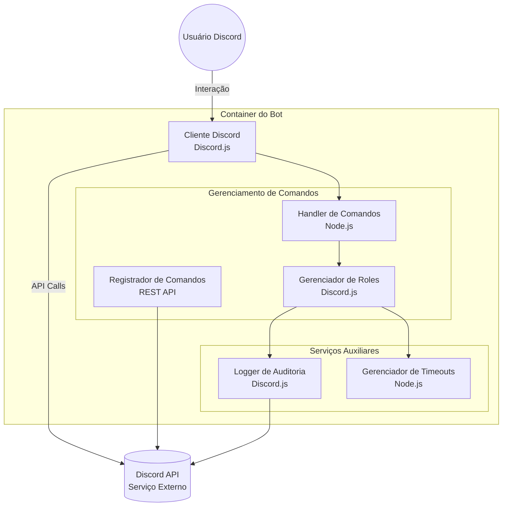

# 📦 **Mongaboss Discord Bot**

Um bot de administração para servidores Discord, simplificando a gestão de roles temporárias e logs.

## Docker Hub
[**lorthe/discord-mongaboss**](https://hub.docker.com/r/lorthe/discord-mongaboss)

---

## ⚙️ **Configuração**

### Variáveis de Ambiente

Defina as variáveis de ambiente no arquivo `.env`:

| Variável             | Descrição                                  | Exemplo                              |
|----------------------|--------------------------------------------|--------------------------------------|
| `MONGABOSS_DISCORD_TOKEN`      | Token do bot                               | `xxxxxxxxxxxxxxxxxxxx`               |
| `MONGABOSS_DISCORD_CLIENT_ID`  | ID do cliente do bot                       | `1311076424395915415`                |
| `MONGABOSS_DISCORD_SERVER`     | ID do servidor                             | `406071925815902208`                 |
| `MONGABOSS_LOG_CHANNEL_ID`     | ID do canal de logs                        | `1097557088818954250`                |
| `MONGABOSS_ROLE_MONGA_NAME`    | Nome da role especial `monga`              | `🐵monga`                            |
| `MONGABOSS_ROLE_ADMIN`         | Nome da role de administrador              | `Administrador`                      |
| `MONGABOSS_TIME_ROLE`          | Duração (em minutos) para roles temporárias| `1440` (24 horas)                    |
| `MONGABOSS_DEPLOY_COMMANDS`    | Atualizar comandos no Discord?             | `1` (Sim), `0` (Não)                 |

---

### 🐳 **Deployment com Docker Compose**

1. Crie o arquivo `docker-compose.yml`:

```yaml
version: '3.8'
services:
  mongaboss:
    image: lorthe/discord-mongaboss:latest
    container_name: mongaboss
    environment:
      - MONGABOSS_DISCORD_TOKEN=${MONGABOSS_DISCORD_TOKEN}
      - MONGABOSS_DISCORD_CLIENT_ID=${MONGABOSS_DISCORD_CLIENT_ID}
      - MONGABOSS_DISCORD_SERVER=${MONGABOSS_DISCORD_SERVER}
      - MONGABOSS_LOG_CHANNEL_ID=${MONGABOSS_LOG_CHANNEL_ID}
      - MONGABOSS_ROLE_MONGA_NAME=${MONGABOSS_ROLE_MONGA_NAME}
      - MONGABOSS_ROLE_ADMIN=${MONGABOSS_ROLE_ADMIN}
      - MONGABOSS_TIME_ROLE=${MONGABOSS_TIME_ROLE}
      - MONGABOSS_DEPLOY_COMMANDS=${MONGABOSS_DEPLOY_COMMANDS}
    restart: unless-stopped
```

2. Crie o arquivo `.env` no mesmo diretório:

```dotenv
MONGABOSS_DISCORD_TOKEN=SeuTokenAqui
MONGABOSS_DISCORD_CLIENT_ID=SeuClientIdAqui
MONGABOSS_DISCORD_SERVER=SeuServerIdAqui
MONGABOSS_LOG_CHANNEL_ID=SeuChannelIdAqui
MONGABOSS_ROLE_MONGA_NAME=🐵monga
MONGABOSS_ROLE_ADMIN=Administrador
MONGABOSS_TIME_ROLE=1440
MONGABOSS_DEPLOY_COMMANDS=1
```

3. Inicie o bot:

```bash
docker-compose up -d
```

---

### ⚡ **Rodando Manualmente com Docker**

```bash
docker run -d \
  -e MONGABOSS_DISCORD_TOKEN=seu_token \
  -e MONGABOSS_DISCORD_CLIENT_ID=seu_client_id \
  -e MONGABOSS_DISCORD_SERVER=seu_server_id \
  -e MONGABOSS_LOG_CHANNEL_ID=canal_logs \
  -e MONGABOSS_ROLE_MONGA_NAME=🐵monga \
  -e MONGABOSS_ROLE_ADMIN=Administrador \
  -e MONGABOSS_TIME_ROLE=1440 \
  -e MONGABOSS_DEPLOY_COMMANDS=1 \
  --name mongaboss lorthe/discord-mongaboss:latest
```

---

## 🚀 **Execução Local**

### Pré-requisitos
- Node.js  
- NPM  

### Passos:

```bash
# Clone o repositório
git clone https://github.com/MongaGit/discord-mongaboss.git
cd discord-mongaboss

# Instale as dependências
npm install

# Configure o arquivo .env
cp .env.example .env
nano .env

# Inicie o bot
node bot.js
```

---

## 📊 **Arquitetura do Sistema**


